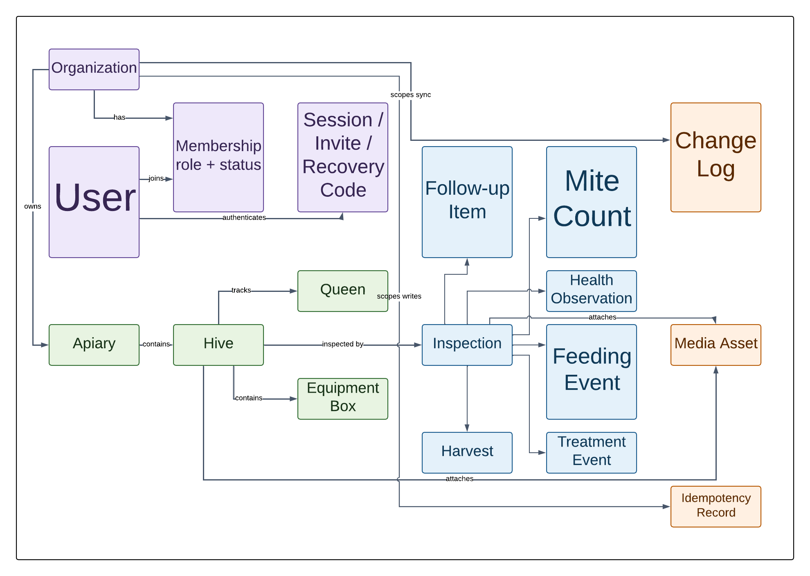

# MVP Data Model

## Purpose

This document defines the current logical model implemented by both D1 and Compose.
The migration SQL and generated schema documentation become authoritative at build
time; this narrative explains ownership, lifecycle, and relationships.

The editable source is Lucid document
`a22b915a-180b-47c9-b495-c68d3528cc99` in the `ApiaryLens` folder.

## Shared Record Contract

Every organization-owned synchronizable record contains:

| Field | Meaning |
|---|---|
| `id` | Stable UUID generated client-side or server-side |
| `organization_id` | Required authorization and synchronization boundary |
| `version` | Monotonically increasing optimistic-concurrency version |
| `created_at` | Server-normalized ISO timestamp |
| `updated_at` | Server-normalized ISO timestamp of current version |
| `deleted_at` | Tombstone timestamp or null |

User input timestamps such as inspection time and queen acquisition date are
separate domain fields. They never replace versioning or server ordering.

## Identity and Access

| Entity | Purpose and notable relationships |
|---|---|
| Organization | Durable tenant/workspace and owner of all apiary records |
| User | Login identity; may join multiple organizations |
| Membership | User-to-organization role, capabilities, status, and revocation time |
| Session | Hashed opaque browser session with idle/absolute expiry and device label |
| Invitation | One-time hashed invite token, intended role, expiry, and acceptance state |
| Recovery Code | One-time hashed owner recovery credential and consumption state |
| Audit Event | Security/administrative action with actor, target, result, and redacted context |

## Apiary Structure

| Entity | Purpose and notable relationships |
|---|---|
| Apiary | Named location, timezone, optional coordinates, notes, and active state |
| Hive | Apiary-owned colony record, label, type, status, installed date, and notes |
| Queen | Hive queen history including mark/color, origin, year, status, and dates |
| Equipment Box | Hive equipment stack item with type, position, frame count, and state |

Exact location is sensitive. Exports include it only for authorized complete export;
demo and public data use generated locations.

## Inspection and Care Events

Inspection is the field-work aggregate: date/time, inspectors, weather snapshot,
temperament, queen/eggs/brood/food observations, population/space assessment,
notes, actions, and completion state. Related structured events are:

- mite count: method, sample size, count, percentage, and notes;
- health observation: category, severity, evidence, and resolution state;
- feeding event: feed type, amount, unit, method, and date;
- treatment event: concern, product, amount/unit, start/end, withdrawal, and result;
- harvest: product, quantity/unit, source boxes, date, and notes;
- follow-up item: description, due date, priority, completion, and assignee; and
- media asset: authorized file metadata linked to an inspection and/or hive.

Care events may be entered during an inspection or independently. Their stable IDs
make both workflows equivalent for synchronization and reports.

## Platform Records

- Change log provides organization-scoped ordered sync changes and tombstones.
- Idempotency record binds a client operation ID to its actor, request fingerprint,
  status, response, and expiry.
- Migration history records every applied schema version and checksum.
- Release state records product and contract versions used for backup/restore and
  diagnostics.

## Isolation Rules

- Every query for organization-owned data receives the authorized organization ID
  from server session context.
- A requested record ID is always combined with that organization predicate.
- Foreign keys cannot cross organizations; service-layer checks cover relationships
  SQLite cannot express with a simple foreign key.
- Complete export, backup metadata, media access, and sync cursors are scoped to one
  organization unless an operator performs an explicitly documented whole-instance
  recovery.

## Future Extensions

Frames, sensors, weather providers, bloom datasets, public shares, clubs, AI review,
research studies, galleries, registries, and commercial workflows extend the same
organization, event, media, version, and change-log contracts. They do not require a
new edition or a SaaS account.

