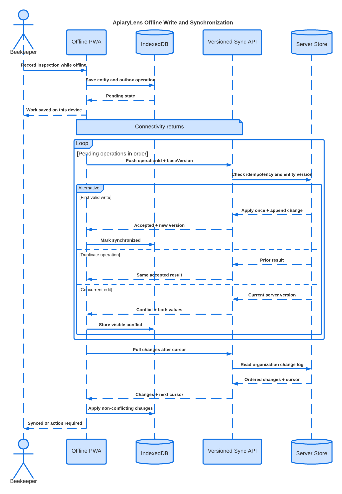

# Offline Synchronization Protocol

## Contract Versions

The HTTP API uses `/api/v1`. Sync messages include `syncContractVersion`, currently
`1`. Client local-schema, server migration, export, deployment-plan, and product
versions are independently visible in the release manifest.

The editable source is Lucid document
`8e918109-d2e8-4392-a514-cc0f677daf11` in the `ApiaryLens` folder.

## Local Write

1. Validate input with the shared schema.
2. Create or update the IndexedDB entity with a stable UUID and local revision.
3. In the same Dexie transaction append an outbox operation containing a stable
   operation ID, entity type/ID, base server version, normalized payload, and local
   creation sequence.
4. Show `pending` immediately. Network availability never gates saving field work.

Pending media blobs are stored separately and reference their metadata operation.
The UI shows device storage and upload state.

## Push

`POST /api/v1/sync/push` accepts a bounded ordered batch. Each item contains:

- `operationId`, `entityType`, `entityId`, `action`, `baseVersion`, and `payload`;
- the client instance ID and sync contract version; and
- no session token, organization grant, or server-authoritative timestamp.

The session selects the user and organization. For each operation, the server checks
authorization and a request fingerprint. A repeated identical operation returns the
stored result. Reuse with a different fingerprint fails as a security error.

## Pull

`GET /api/v1/sync/pull?cursor=...&limit=...` returns ordered changes visible to the
active membership, a next cursor, and whether more pages remain. The cursor is
opaque and bound to organization and contract version. An expired cursor produces a
full-resync instruction; it never causes silent gaps.

## Conflict Rules

- Append-only events with distinct IDs normally coexist.
- A mutable record applies only when `baseVersion` equals the current version.
- A safe field-level merge is allowed only for explicitly registered independent
  fields and is recorded in the result.
- Otherwise the server returns both normalized values and changed-field metadata.
  The client stores a `conflicted` record and asks the user to keep server, keep
  local as a new version, or create a manually combined version.
- Deletes are versioned tombstones and can conflict with edits.

Treatment, health, queen, and completed-inspection conflicts are never resolved with
silent last-writer-wins.

## Authentication and Offline Work

The browser session is not stored in IndexedDB. A previously opened workspace may
remain usable offline according to the user's device and local-data settings. Push,
pull, invitations, export, and membership changes require a valid live session.
Revocation takes effect at the server immediately and locally on the next contact;
remote revocation cannot erase offline browser storage, which is documented to the
owner.

## Update Compatibility

A new service worker can activate when in-progress forms are durable and its local
schema can migrate with the current outbox. The release manifest declares readable
local schema versions and accepted sync versions. If incompatible, the client keeps
the compatible version active and guides export, synchronization, or administrator
update instead of discarding pending work.

## Observability

The local status model is `local`, `pending`, `synchronizing`, `synchronized`,
`conflicted`, or `failed`. The diagnostics view shows redacted operation IDs,
entity type, retry count, last result, cursor age, and version compatibility. No
telemetry leaves the deployment by default.

