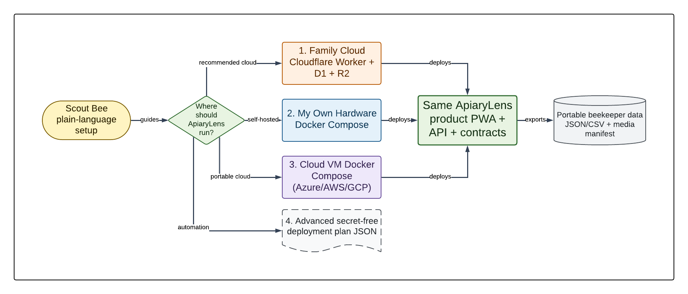

# Scout Bee Deployment Design

## Purpose

Scout Bee is ApiaryLens's guided deployment and update application. Its default
language is for beekeepers; its exported plan and logs are precise enough for an
operator or CI system.

## Components

| Component | Responsibility |
|---|---|
| React UI | Questions, recommendation, cost/ownership explanation, progress, recovery, and diagnostics |
| Go executor | Loopback API, preflight, safe process/SSH execution, target adapters, and structured logs |
| Plan schema | Versioned, secret-free declaration of target, release, resource references, storage, networking, backup, and requested operations |
| Release bundle | Pinned Compose/Worker artifacts, migrations, checksums, SBOM, provenance, and release manifest |

The executor binds only to loopback on a random port and requires a random launch
token passed to the UI through a URL fragment. It rejects remote binding. Browser
responses use restrictive CSP, no external assets, and no telemetry.

## Guided Flow

1. Choose Family Cloud, My Own Hardware, Cloud VM, or Advanced Plan.
2. Explain availability, ownership, expected cost, account/tool prerequisites,
   backup responsibility, and portability.
3. Gather non-secret configuration and request secret values only when applying.
4. Validate a deployment plan and show the exact intended actions.
5. Run preflight without changing the target.
6. Apply only after explicit confirmation.
7. Verify health, product/contracts, authentication bootstrap state, storage, and
   backup readiness.
8. Save a redacted result and next-step instructions.

## Remote Compose Adapter

- Uses OpenSSH argument arrays and host-key verification.
- Accepts host, port, user, and target directory; credentials are never serialized
  into the plan.
- The HTTPS address must use a resolvable hostname with a certificate authority
  trusted by the operator device. The current release candidate does not accept a
  raw private-IP address as a working HTTPS endpoint because certificate selection
  requires a server name.
- Verifies Linux architecture, Docker Engine, Compose v2, space, time, ports, and
  release requirements.
- Transfers an immutable release bundle, verifies checksums, writes restrictive
  secret files, and applies Compose with a unique project name.
- Runs migrations once, waits for health, and performs an authenticated smoke test.
- Creates and verifies a backup before update; failed activation selects compatible
  rollback or complete restore according to migration reversibility.

The adapter is provider-neutral. Hyper-V, Azure, AWS, GCP, a home server, and a
hosted Linux VM differ only in provisioning and connection inputs.

## Cloudflare Adapter

- Uses a user-owned API token with the minimum documented permissions.
- Lists intended resources before creation and supports safe reuse by exact plan
  identity.
- Creates D1/R2 resources only when absent, applies migrations, uploads secrets via
  the provider secret API, and deploys the pinned Worker/static-assets build.
- Validates custom domain/TLS when requested and verifies D1/R2 access through the
  health/readiness endpoint.
- Shows the exact dated Workers, D1, and R2 free allowances, relevant exclusions and
  exhaustion behavior, and requires acknowledgement that provider pricing or limits
  can change before Cloudflare preflight or apply.
- Supports D1 Time Travel guidance plus a product-level relational/media export.
- Creates a one-time random maintenance authorization for backup, export, and
  restore, removes it when the operation ends, and leaves the maintenance routes
  indistinguishable from a missing endpoint at all other times.
- Writes a verified ZIP containing identity data, family records, change history,
  recovery codes, and private media. Restore validates the backup contract, creates
  a local pre-restore recovery archive, restores allow-listed tables and media,
  revokes prior sessions, and verifies release health.
- Installs the user-chosen one-time owner setup code atomically with the first
  Worker revision. Runtime credentials and local backup paths never enter the
  deployment plan or diagnostic bundle.

## Plan Safety

The schema rejects unknown properties, relative remote target paths, public HTTP,
no-auth network profiles, floating release tags, missing checksums, and embedded
secret-looking fields. Executors use allow-listed actions and never interpolate a
plan value into a shell command string.

## MVP Acceptance

- Generate, validate, dry-run, apply, re-run, and export a Cloudflare plan.
- Generate, validate, dry-run, apply, re-run, update, back up, and restore a Compose
  plan against the Hyper-V UAT VM.
- Apply the same Compose plan shape to an existing Azure VM at the first UAT
  checkpoint when the environment is available.
- Produce redacted diagnostics and deterministic non-zero failure codes.
- Provide equivalent operator documentation without Scout Bee.
