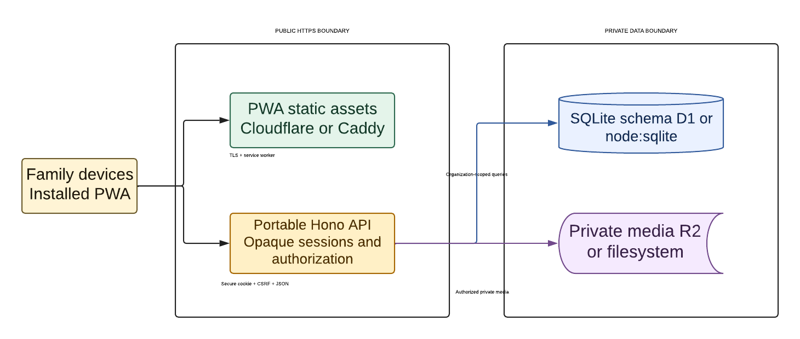
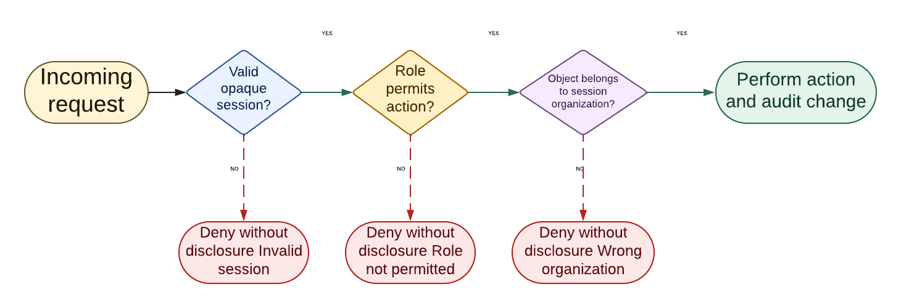
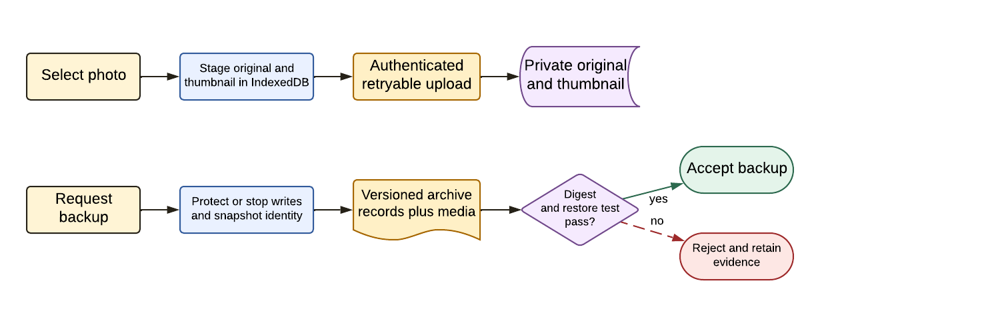
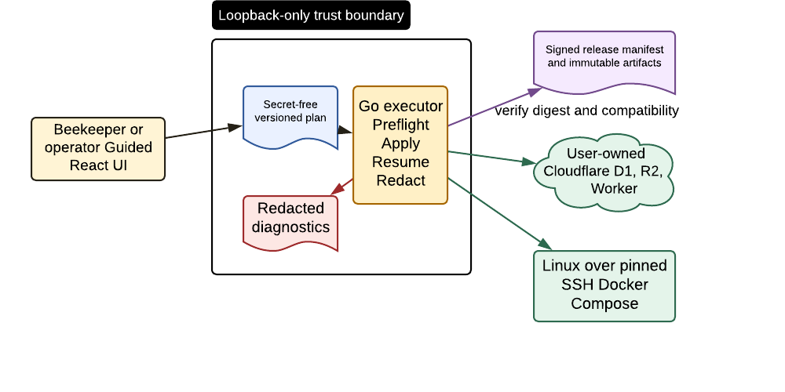
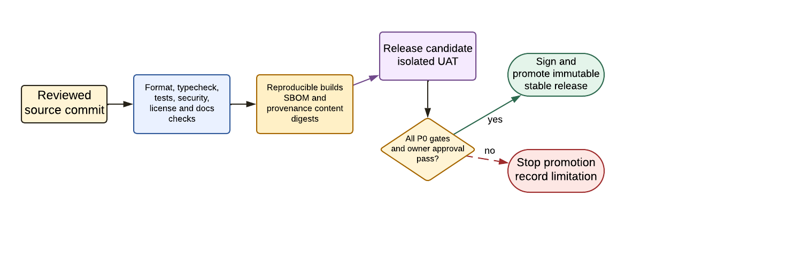
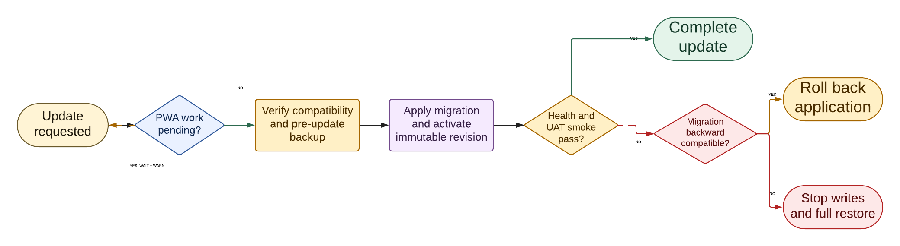
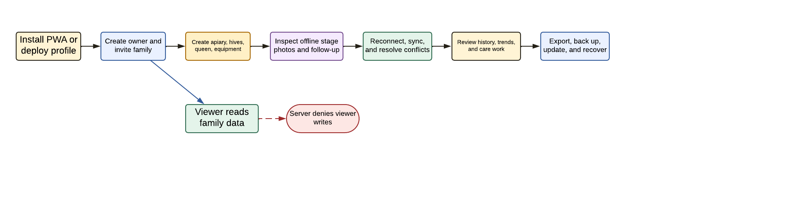

# Operational Architecture and Journeys

The editable sources for this seven-page set are the cataloged Lucidchart documents
in the dedicated `ApiaryLens` folder. Four pages remain in document
`72787958-9344-4a71-af56-98a216b35aa1`; the final-polish component and update pages
are in `f22ae65e-c353-488e-ba54-51f7de4c189c`, and authorization is in
`97b127d3-5a52-4232-bf90-99e59966d987`. The descriptions below are the accessible
text alternative and define the intended reading order.

## Components and Network Trust

Family devices install the PWA and use TLS, secure cookies, CSRF protection, and
JSON requests. Static assets and the portable API sit inside the public HTTPS
boundary. Only organization-scoped API queries reach SQLite, and only authorized
media operations reach originals and thumbnails in private storage.

## Authorization Boundaries

Authorization is a three-gate server decision: authenticate the opaque session,
authorize the role action, and verify object ownership by the session organization.
Failure at any gate returns a denial without revealing whether another family's
object exists.

## Media, Backup, and Restore

Media remains available offline because the original and thumbnail are staged
before upload. Backup acceptance is separate: protect writes, snapshot release
identity, create the versioned records-and-media archive, and reject it unless both
integrity validation and a restore test pass.

## Scout Bee Executor

Scout Bee binds only to loopback. The plan is shareable because it contains no
runtime credentials. The executor validates compatibility and artifact digests,
then applies allow-listed operations to Cloudflare or to Linux over pinned SSH.

## CI/CD and Release Promotion

Promotion is gated, not calendar-driven. A failed P0 requirement or missing owner
approval stops promotion and becomes a recorded release limitation.

## Update, Rollback, and Recovery

Pending device work prevents activation. After deployment, a failing health/UAT
smoke test branches on migration compatibility: compatible migrations permit code
rollback; incompatible or partial migrations require stopping writes and restoring
the complete pre-update backup.

## Primary MVP User Journeys

The main journey spans ownership, field work, shared care, and recovery. The viewer
branch makes negative authorization explicit: read access never implies a client or
server write capability.
