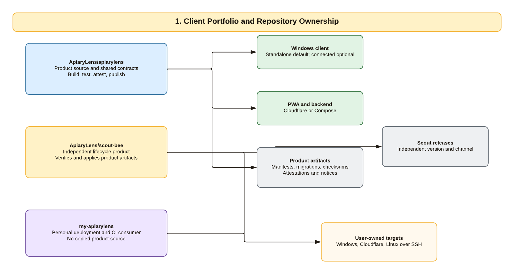
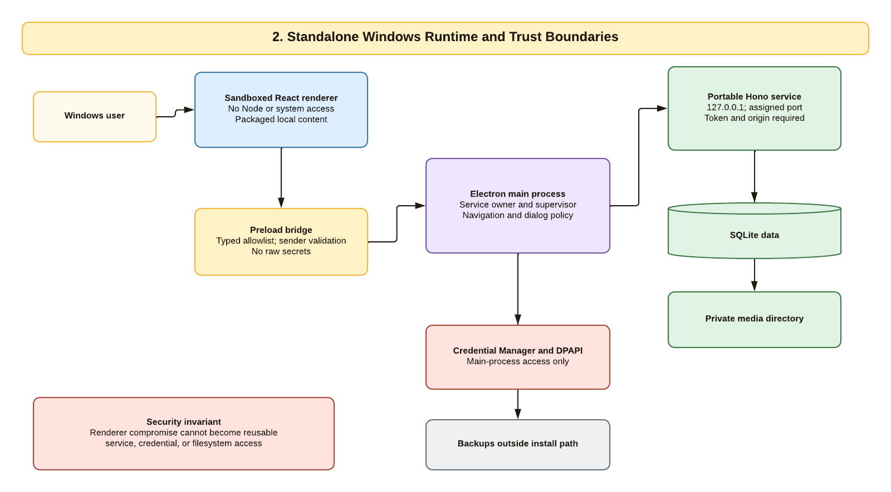
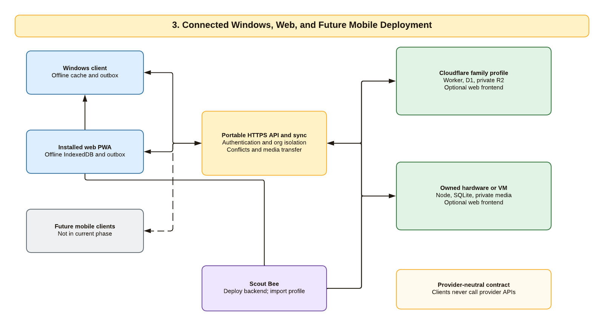
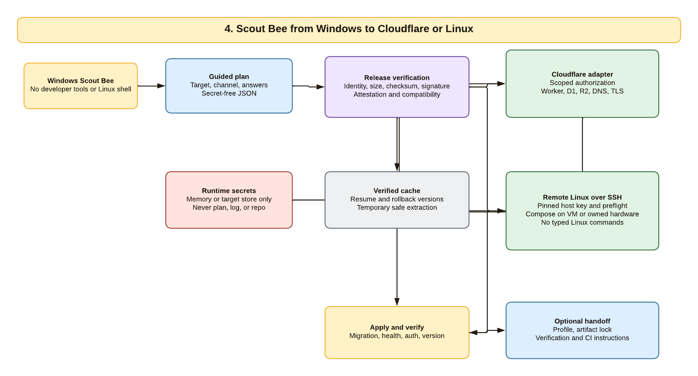
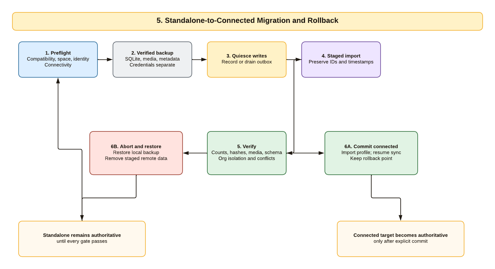
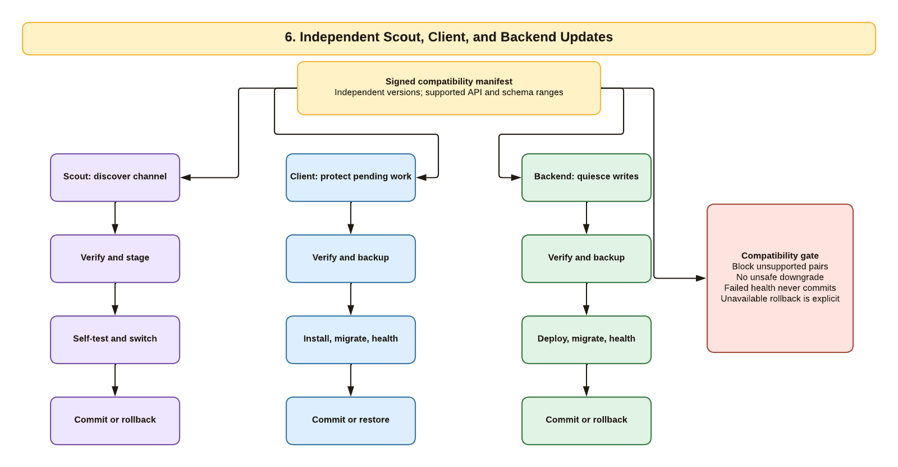
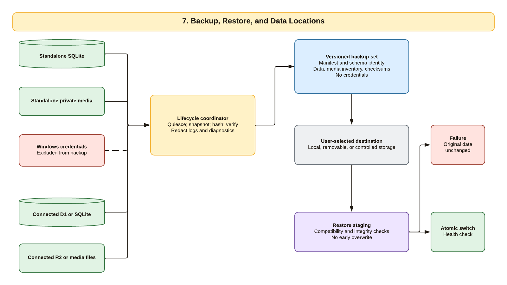

# Windows Client and Scout Bee Architecture

This page is the accessible companion to the seven-page authoritative Lucidchart
document `ApiaryLens - Windows and Scout Architecture`. The diagrams describe the
approved planning and research baseline. They do not authorize product
implementation or claim that Preview acceptance testing is complete.

## Client Portfolio and Repository Ownership

`ApiaryLens/apiarylens` owns product source, shared UI and domain behavior, API and
schema contracts, build automation, and immutable product artifacts. It builds,
tests, attests, and publishes; it never deploys a personal environment. The separate
`ApiaryLens/scout-bee` repository owns the installer and lifecycle application and
has its own version and release channel. `my-apiarylens` is a personal deployment
and CI consumer. It can retain a secret-free plan, artifact lock, verification
record, and operator automation, but it does not contain copied product source.

## Standalone Windows Runtime and Trust Boundaries

The Windows user interacts with packaged React content in a sandboxed renderer.
Renderer JavaScript has no Node, filesystem, process, database, or reusable
credential access. A versioned, sender-validated preload bridge exposes only typed
operations. The Electron main process owns navigation and native-dialog policy,
protects durable credentials with the accepted Windows adapter, and supervises one
portable service on `127.0.0.1` with an operating-system-assigned port and a
per-launch control credential. SQLite, private media, and backups live in documented
per-user data locations outside the executable installation directory. Credentials
are separate from backups.

## Connected Windows, Web, and Future Mobile Deployment

Windows and PWA clients keep local offline state and an outbox, then synchronize
automatically through the same authenticated, organization-isolated API. A family
selects one compatible backend: Cloudflare Worker, D1, and private R2, or the
portable Node service, SQLite, and private filesystem media on owned hardware or a
VM. Scout manages the selected deployment and imports a secret-free connection
profile into the Windows client. Clients never call Cloudflare, SSH, or another
provider-specific administration API. Native mobile clients are a future decision,
not current implementation scope.

## Scout Bee from Windows to Cloudflare or Linux

Scout runs on Windows without requiring Go, Node, WSL, Docker, a Linux shell, or
typed Linux commands from the family user. It resolves an exact channel and release,
verifies identity, size, checksum, signature, attestation, and compatibility, and
caches verified versions for resume and rollback. Cloudflare authorization or SSH
credentials exist only in memory or the target secret store and never enter the
deployment plan, logs, diagnostics, or repositories. Scout applies the selected
adapter, runs migration and health gates, and only then exports an optional client
profile or CI handoff bundle.

## Standalone-to-Connected Migration and Rollback

Standalone data remains authoritative until every migration gate passes. Scout or
the lifecycle coordinator first validates compatibility, identity, space, and
connectivity; creates and verifies a database and media backup; and records or
drains pending local work. The remote import is staged without changing local
authority. Counts, hashes, media, schema identity, organization isolation, and
conflicts must pass before the connection profile is committed and automatic sync
resumes. Any failure restores the verified local backup and safely removes staged
remote data. The connected target becomes authoritative only after explicit commit.

## Independent Scout, Client, and Backend Updates

Scout, the Windows client, and the backend have independent versions and release
channels. A signed manifest declares supported API, schema, client, backend, and
Scout ranges. Scout verifies and self-tests its own update. The client protects
pending offline work, verifies and backs up, then installs, migrates, and health
checks. The backend quiesces writes, verifies and backs up, deploys, migrates, and
health checks. No state machine commits a failed health result. Unsupported
client/backend pairs, unsafe direct downgrade, and unavailable rollback are explicit
stops rather than silent best-effort behavior.

## Backup, Restore, and Data Locations

The backup coordinator can operate on standalone SQLite and private media or on the
selected connected database and media profile. It quiesces writes, creates a
consistent snapshot, records schema and release identity, inventories media, and
verifies checksums before declaring success. Windows and provider credentials are
not part of the backup set. Restore reads from a user-selected destination into
staging, checks compatibility and integrity, and switches atomically only after all
gates pass. A failure leaves the original data unchanged.

## Source and Review Record

- Lucid document: `f518f689-89dc-42d6-8200-bbb43467debe`, pages 1 through 7.
- Filed in the dedicated private `ApiaryLens` Lucid folder on 2026-07-17.
- All seven public PNG exports were generated through the Lucid API and inspected at
  their committed 1,600-pixel width.
- Two rejected drafts with connector or label collisions were renamed `REJECTED`
  and removed from the authoritative folder.
- The explanatory text on this page is the accessible alternative when a diagram
  cannot be seen or interpreted visually.
