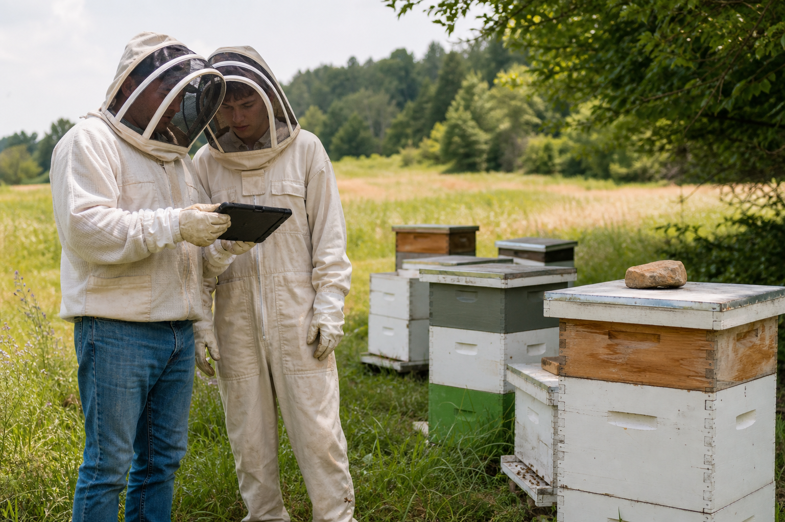
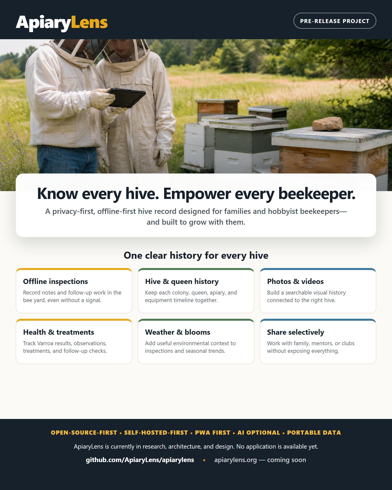

# ApiaryLens Marketing Overview

- **Status:** Public Preview 1 product messaging
- **Last reviewed:** 2026-07-17

> **Tagline:** Know every hive. Empower every beekeeper.

ApiaryLens is an open-source apiary intelligence and hive-management application for
people who keep bees and want an easier way to remember what is happening in every
hive. It begins with a family or hobbyist and keeps the same portable history as the
apiary grows toward mentors, clubs, education, research, and professional work.

It is being designed to help answer practical questions:

- Which hive needs to be checked next?
- When did we last see the queen?
- Did the mite count go up or down?
- Which hive was fed or treated?
- What photos did we take during the last inspection?
- When did we harvest honey?
- What may be blooming nearby?
- Should we ask a mentor to review this frame or inspection?

ApiaryLens Public Preview 1 is an early, usable product—not GA or a stable release.
The safe synthetic demo, installable PWA, Cloudflare family profile, Docker Compose
profile, documentation, and verifiable artifacts are available for controlled
evaluation. Features and workflows may change, and updates may arrive frequently,
sometimes multiple times in a day. Scout Bee and the standalone Windows application
remain separate future releases.

Keep current backups while evaluating Preview 1. ApiaryLens must not be the sole
copy of irreplaceable hive records or media.

## What ApiaryLens Helps You Do

- Keep hive notes and history together.
- Track apiaries, hives, queens, inspections, equipment, mite counts, feeding,
  treatments, harvests, follow-ups, and manual weather observations.
- Build a private visual history of each hive with original photos and thumbnails.
- Work from a phone or tablet in the bee yard without dependable internet access,
  then synchronize later when using a connected deployment.
- Share authorized family history through owner, beekeeper, and viewer roles without
  exposing another organization.
- Export and retain control of hive data and media.
- Grow from one hive toward family, club, research, or commercial use without
  moving to an incompatible product.

## Built for Real Beekeeping

The first target is a family or hobbyist beekeeper using phones, tablets, and
computers. ApiaryLens begins with an offline-first Progressive Web App so field
records remain usable when service is poor or absent.

Public Preview 1 supports two approachable server profiles:

- **Family Cloud:** synchronized records in the beekeeper's own Cloudflare account
- **My Own Hardware or VM:** the complete Docker Compose server on an ordinary Linux
  machine the beekeeper controls

Device-only personal use and expanded club, commercial, education, extension, and
research workflows are post-MVP roadmap tracks. The portable core and export format
keep those paths open without forcing a paid cloud, AI provider, or proprietary data
format.

## Current MVP Capability Areas

- Apiaries, hive locations, and hive history
- Boxes, frames, and other hive equipment
- Queens and queen history
- Inspections, notes, reminders, and follow-up work
- Private original photos and thumbnails
- Varroa counts, health observations, and treatments
- Feeding and consumption notes
- Manual weather snapshots; regional weather and bloom intelligence remain later
- Honey and wax harvests
- Sharing, reports, exports, and trends

The accepted [MVP definition](mvp-definition.md) is the binding boundary. The
[Product Capability Overview](product-capability-overview.md) and
[Roadmap](../roadmap/roadmap.md) distinguish implemented MVP capabilities from the
broader product direction.

## Open-Source and Self-Hosted Direction

ApiaryLens is an open-source, self-hosted-first product with an offline-capable PWA
and portable data. The public product uses the OSI-approved Apache License 2.0.
Release-candidate messaging distinguishes implemented capabilities from later
roadmap direction.

The intended outcome is:

- No required paid cloud account for the core self-hosted product
- No required AI subscription
- No telemetry or data egress by default
- Local and Docker Compose deployment paths
- Guided installation, update, backup, restore, and diagnostics
- A measured free or predictably near-free family-cloud reference where practical
- A future optional hosted service without making self-hosting second-class

## Future Direction

Later phases may include AI-assisted photo observations, inspection summaries,
native iPhone and Android clients, hive scales and sensors, Home Assistant, bee-club
workflows, research tools, and commercial-apiary capabilities.

AI will provide optional observations rather than final diagnoses. Native clients
will connect to a beekeeper's chosen compatible deployment. Community galleries or
registries may be considered when justified, but no plugin marketplace is committed.

## Data Promise

> **Working message:** Your bees. Your data. Your future.

ApiaryLens should help people care for bees, remember what happened, learn over
time, and keep control of the records they create.

## Visual Overview

The current marketing visual deliberately shows real family-scale beekeeping rather
than a fictional finished application interface.

The structured [capability map](../../assets/graphics/ApiaryLens_Capability_Map_2026-07.png)
and [current roadmap](../../assets/graphics/ApiaryLens_Roadmap_2026-07.png) are
maintained as Lucidchart diagrams and may be reused when detailed visual context is
needed.

## Shareable Handout

The following 4:5 Public Preview handout is designed for social posts, messaging,
and email. It uses reviewed project language and directs people to the live public
project and documentation home.

