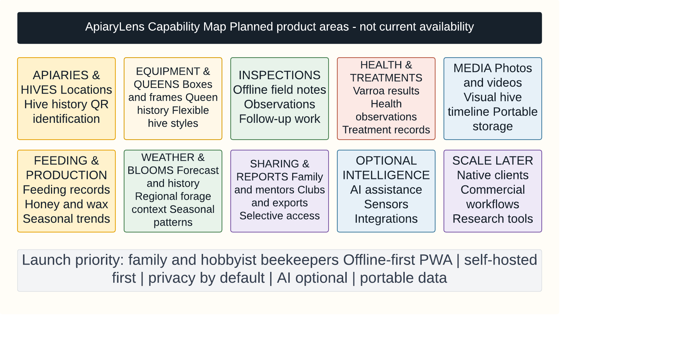
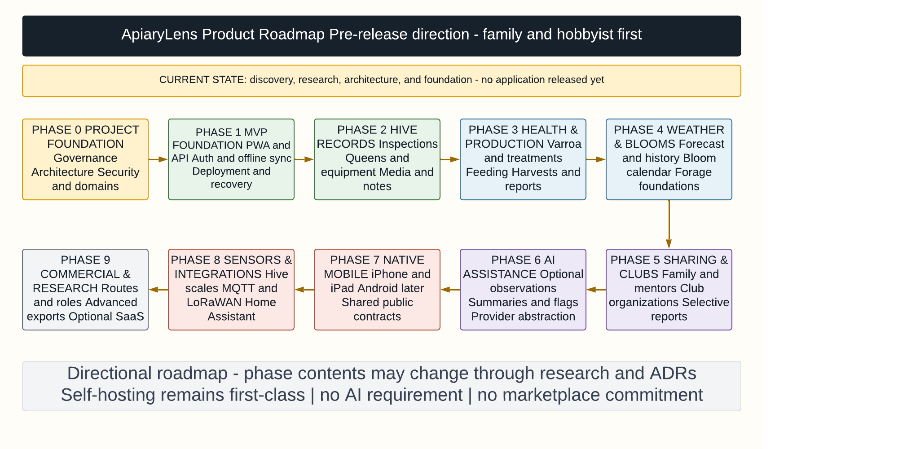

# ApiaryLens Product Capability Overview

- **Status:** Living product overview
- **Last reviewed:** 2026-07-15

ApiaryLens is an open-source, self-hosted, offline-first apiary intelligence and
hive-management platform. It is intended to help beekeepers understand and act on
the history of their apiaries, hives, queens, inspections, health, media, weather,
blooms, harvests, sharing, and long-term colony trends.

This document describes planned product capabilities and why they matter. It is
not an engineering design, release promise, or statement that the capabilities
already exist. The repository currently contains foundation and design material,
not a working application. The authoritative delivery sequence is the
[roadmap](../roadmap/roadmap.md); detailed requirements remain in the
[feature inventory](../architecture/feature-inventory.md), and architectural
constraints remain in the Master Architecture and Design Plan, part of the
ApiaryLens design record (private, see [docs/RELOCATED.md](../RELOCATED.md)).

## Product Positioning

ApiaryLens should be simple enough for a first-year beekeeper and capable of
growing with a family, mentor group, bee club, commercial apiary, school,
extension office, or research project.

The durable direction is:

- Open source and self-hosted first
- Offline-first in the bee yard
- Mobile and outdoor friendly, beginning with a PWA
- Privacy-first, with no data egress or telemetry by default
- Secure according to deployment exposure
- AI-assisted, but never AI-required
- Portable from device-only use through family and organization deployments
- Capable of supporting an optional hosted service later without weakening self-hosting

## Primary Users

The launch priority is the family or hobbyist beekeeper. Other users guide the
architecture and roadmap so growth does not require a replacement product.

| User | Outcome ApiaryLens should support |
|---|---|
| New beekeeper | Record inspections, reminders, photos, queens, and mentor-ready history without a complicated setup |
| Family beekeeper | Share one synchronized record across family members, phones, tablets, and computers |
| Mentor or bee club | Review selected records, manage training hives, and help beginners without seeing unrelated private data |
| Commercial beekeeper | Grow to many apiaries, hives, workers, routes, movements, production records, and reports |
| Educator, extension office, or researcher | Collect repeatable observations and export structured, portable data with environmental context |

## Planned Core Capability Areas

These are durable product areas, not a single MVP release bundle. Their current
phase assignments are maintained in the roadmap.

### Apiaries and Hives

Track multiple apiaries and hives. Each hive develops a durable history of its
location, colony, equipment, queen, inspections, health, media, weather context,
and production. The initial foundation for apiaries and hives is planned for
Phase 1.

### Equipment and Queens

Represent real hive equipment without assuming one hive style. Planned models
include boxes, frames, bottom boards, covers, feeders, queen excluders, nucs,
observation hives, and custom components. Langstroth, top-bar, Warré, Layens,
Flow-style, nuc, observation, and custom configurations remain product direction,
with detailed scope subject to design.

Queen history should include identity, source or lineage, marked status,
introduction and acceptance, sightings, brood pattern, temperament, performance,
swarming, supersedure, and current status.

### Inspections and Field Workflow

Inspections should be fast to record from a phone or tablet in the bee yard with no
network connection. Planned records include notes, checklists, media, weather,
queen and brood observations, stores, swarm signs, pests, temperament, and follow-up
work. Voice capture remains a candidate rather than a committed delivery item.

### Photos and Videos

Hives should have a searchable visual history. Media may be associated with
inspections, queens, frames, health concerns, harvests, or the general hive timeline.
Storage, retry, synchronization, privacy, and export behavior are part of the
product—not afterthoughts.

### Health, Mites, and Treatments

Track Varroa testing, methods, results, thresholds, pest and disease observations,
treatments, product and dosage notes, treatment windows, restrictions, follow-up
checks, and trends. ApiaryLens records and explains observations; it must not present
AI output as a definitive disease diagnosis or replace qualified local guidance.

### Feeding, Harvest, and Production

Record syrup, dry sugar, fondant, patties and supplements, quantities, reasons, and
consumption. Production history may include honey and wax harvests, frames and supers
pulled, weight, moisture, batches, containers, and year-over-year trends.

### Weather and Bloom Intelligence

Relate hive work and colony history to forecast and historical weather, including
temperature, rainfall, wind, humidity, frost, heat, cold, and other relevant events.
Regional bloom and forage observations should help explain nectar and pollen timing
without pretending that generalized data is a guaranteed local prediction.

### Sharing, Mentoring, Reports, and Trends

Allow a beekeeper to share selected apiaries, hives, inspections, media, or reports
with family members, mentors, or clubs without exposing everything. Server-enforced
authorization is required for networked deployments. Reports should grow from
simple operational views into hive strength, queen, mite, treatment, feeding,
production, winter-loss, inspection-frequency, and environmental trends.

## Future Capability Areas

### AI Assistance

Potential AI capabilities include photo observations, brood-pattern review,
inspection summaries, seasonal suggestions, risk flags, and forecasting research.
AI remains optional, replaceable, and advisory. The complete non-AI product must
remain useful when every AI provider is disabled.

### Native Mobile Clients

The PWA comes first. A later downloadable iPhone client may connect to a user's
self-hosted, family-cloud, or future managed deployment using the same public API,
authentication, synchronization, media, and portability contracts. iPad and Android
clients follow the same principle and require their own implementation decisions.

### Sensors and Smart Apiaries

Future integrations may include hive scales, temperature and humidity sensors,
acoustic monitoring, Bluetooth, MQTT, LoRaWAN, weather stations, and Home Assistant.
No sensor or external service is required for core hive management.

### Club, Commercial, Research, and Extension Workflows

Later phases may add training apiaries, mentor review, organization administration,
route planning, employee roles, hive movement, pollination records, inventory,
advanced exports, and repeatable research observations. These extend the same core
data and organization model rather than creating incompatible editions.

### Community Galleries and Registries

Reusable templates, regional datasets, equipment profiles, adapters, integrations,
and plugins may eventually justify community galleries or registries. They are not
committed repositories, centralized services, or marketplaces. Any such design must
follow the
[community gallery and registry criteria](../architecture/community-galleries-and-registries.md).

## Product Principles

- Be useful to a beekeeper with one hive.
- Do not make the beginner experience carry commercial complexity.
- Keep field recording fast, visible, and dependable offline.
- Make photos, history, synchronization state, and follow-up work easy to find.
- Keep data, media, backups, and exports portable.
- Make installation, updating, recovery, and diagnostics approachable.
- Make AI optional and replaceable.
- Protect privacy and local ownership of data.
- Grow toward clubs, commercial users, and researchers without splitting the product.

## Visual Summary

The following current visuals were rebuilt from this overview and the authoritative
roadmap. Their editable sources are maintained in Lucidchart; the committed PNGs are
public, accessible exports for Markdown and release material.

See the [diagram catalog](../diagrams/README.md) for Lucid document identifiers,
status, and export ownership. The written overview and roadmap remain authoritative
if an export becomes stale.
